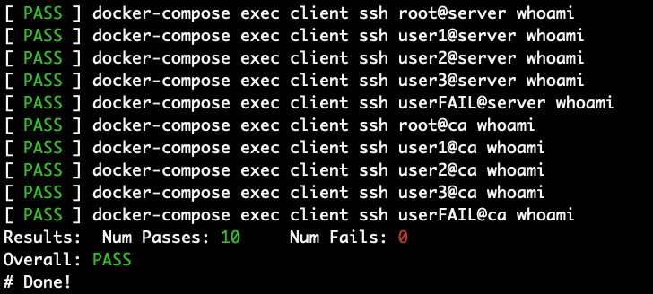

# SSH Principal and CA Playground

## Usage

- Clone this repo with `git clone`.
- Run `./test.sh` which will do the following:
   - Create a key, a CA, and a certificate of that key signed by the CA
   - (re)build 3 Docker containers: `client`, `server`, and `ca`.
   - Run tests on the `client` container to verify that it can/cannot SSH into certain accounts on the `server` and `ca` hosts.

A successful run will end in something like this:

## Playground

I said this project was a playground, and I meant it!  If you'd like to play around yourself,
here's how to get started:

First, attach to the `client` container with `docker-compose exec client bash`.

From there, you can try SSHing into the `server` or the `ca` containers.  The `server`
container has the users `root`, `user1`, `user2`, and `user3`, and you can SSH into any
of those user accounts.

The `ca` container trusts the CA certificate that we created, and has principals set up. 
As such, you can only SSH to the `root`, `user1`, and `user2` users.  `user3` will not work.

## Exercises

If you want to prove to yourself that you fully understand Principals in SSH, try some of
these exercises:

- Configure `ca` so you can log in as `user3` on `ca` with the existing Principals of `root`, and `user2`.
- Add the Principal `user3` to the user key, and use it to log in as `user3` on `ca`.
- Replace the `root` Principal from the user key and add `sysadmin`.  Configure `ca` so that you can log in as the `root` user again.

## Development

These are some helper scripts I wrote to help streamline my development:

- `./bin/clean.sh` - Kill all containers (or an existing container, if specified), remove them, (re)build them, and start them back up.
- `./bin/attach.sh` - Attach to any running container.
- `./bin/clean-and-attach.sh` - Nice wrapper script for the previous two commands. :-)
- `./bin/logs.sh` - Display logs from all containers, or a single container if specified.

## Notes/Bugs

- Logging in as the `root` user in this app is for demo purposes only.  DO NOT allow root logins on a production system!

## External Links

- <a href="https://engineering.fb.com/security/scalable-and-secure-access-with-ssh/">Scalable and secure access with SSH</a> - The original article from Facebook's engineering blog which got me started down this path.
- <a href="https://smallstep.com/blog/use-ssh-certificates/">If you’re not using SSH certificates you’re doing SSH wrong</a>
- <a href="https://github.com/vedetta-com/vedetta/blob/master/src/usr/local/share/doc/vedetta/OpenSSH_Principals.md">OpenSSH Principals</a>

## Credits

- <a href="https://github.com/panubo/docker-sshd">SSHD Container for Docker</a> - It used in this package, and I've found it to be quite handy!

## Contact

My email is doug.muth@gmail.com.  I am also <a href="http://twitter.com/dmuth">@dmuth on Twitter</a> 
and <a href="http://facebook.com/dmuth">Facebook</a>!

